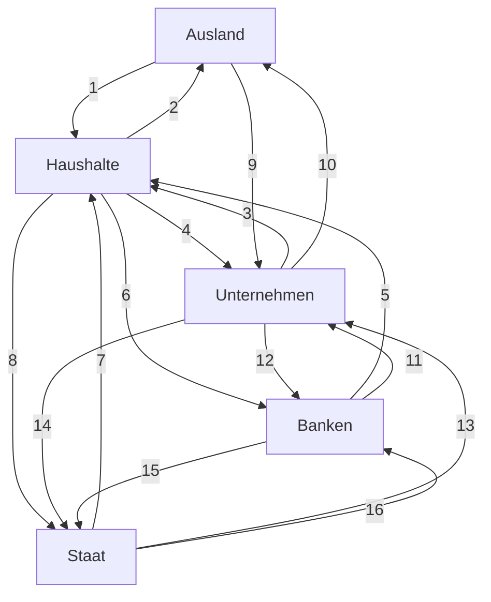
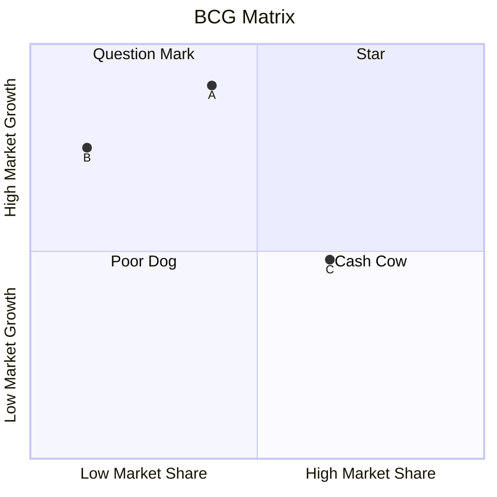

<!-- cSpell:language de -->

# Wirtschaftslehre im StudienKolleg

> # 经济学(预科版)

## 0. Einleitung

### 0.1 Inhalt für den 1. Semester

1. Gegenstand der Wirtschaftswissenschaften, Güterklassifikation

   > 经济学的研究对象，商品分类
   >
2. Modelltheorie: Wirtschaftsmodelle

   > 模型理论：经济模型
   >

   - Modelltheorie

   > - 模型理论
   >

   - *Homo oeconomicus*

   > - 经济人
   >

   - Wirtschaftskreislauf

   > - 经济循环
   >

   - Funktionale Zusammenhänge

   > - 功能关系
   >
3. Modelltheorie: Kennzahlen

   > 模型理论：指标
   >
4. Die VWL

   > 国民经济学
   >

   - Gliederung

     > 分支
     >
   - Geschichte

     > 历史
     >
   - Mikroökonomik

     > 微观经济学
     >
   - Makroökonomik

     > 宏观经济学
     >
5. Die BWL

   > 企业经济学
   >

   - Geschichte

   > - 历史
   >

   - Gliederung ABWL, SBWL

   > - 一般企业经济学，专门企业经济学的结构
   >

   - Analysegegenstände ausgewählter funktionaler SBWL, z.B. BCG-Matrix, Harris-Andler-Formel, das Reisender-Handelsvertreter-Problem, Finanzplan bei einer Unternehmensgründung, Vergleich lineare-geometrische Abschreibung

   > - 选定的功能性专门企业经济学的分析对象，例如BCG矩阵、Harris-Andler公式……
   >
6. Arbeitsteilung

   > 分工
   >

   - Klassifikation nach Karl Bücher

     > 根据卡尔·比歇的分类
     >
   - Arbeitsteilung im Unternehmen (Adam Smith)

     > 企业内的分工（亚当·斯密）
     >
   - Arbeitsteilung in der Volkswirtschaft (Jean Fourastie)

     > 国民经济中的分工（让·富拉斯蒂耶）
     >
   - Arbeitsteilung zwischen den Volkswirtschaften (absoluter und komparativer Kostenvorteil nach Smith, Ricardo)

     > 各国经济间的分工（根据斯密和李嘉图的绝对与比较成本优势）
     >
7. Markt

   > 市场
   >

   - Marktklassifikation, insbesondere Marktformen nach der Zahl der Marktteilnehmer

     > 市场分类，特别是根据市场参与者数量的市场形式
     >
   - Prämissen des vollkommenen Marktes

     > 完全市场的前提
     >
   - Marktgleichgewicht

     > 市场均衡
     >
   - Funktionen des Preises

     > 价格功能
     >
8. Geld

   > 货币
   >

#### 0.1 词汇表

| 德文术语                                                                     | 词性 | 复数形式 | 中文翻译   | 解释/备注                        |
| ---------------------------------------------------------------------------- | ---- | -------- | ---------- | -------------------------------- |
| Wirtschaftswissenschaften | f    | -        | 经济学     | -                                |
| Güterklassifikation           | f    | -en      | 商品分类   | 对商品进行分类的方法。           |
| Modelltheorie                                                                | f    | -n       | 模型理论   | -                                |
| Wirtschaftskreislauf                                                         | m    | -läufe  | 经济循环   | -                                |
| Kennzahlen                                                                   | f    | -        | 指标       | 用于评估的数值指标。             |
| Gliederung                                                                   | f    | -en      | 分支       | 学科或领域的结构划分。           |
| Makroökonomik                                                               | f    | -        | 宏观经济学 | -                                |
| Mikroökonomik                                                               | f    | -        | 微观经济学 | -                                |
| Arbeitsteilung                                                               | f    | -en      | 分工       | -                                |
| Marktklassifikation                                                          | f    | -en      | 市场分类   | -                                |
| Marktgleichgewicht                                                           | n    | -e       | 市场均衡   | -                                |
| Geld                                                                         | n    | -er      | 货币       | -                                |
| Prämisse                                                                    | f    | -n       | 前提       | 作为推理或论证基础的假设或条件。 |

### 0.2 Inhalt für den 2. Semester

9. Produktionsfunktion

> 9. 生产函数

- Produktionsfaktoren nach Smith, Gutenberg

> - 史密斯和古腾堡的生产要素

- Produktionsfunktion

> - 生产函数

- Isoquante Variation: unterschiedliche Faktoreinsatzverhältnisse z.B. limitationale, peripher, alternativ und absolut substitutionale, Ermittlung der Minimalkostenkombination

> - 等产量线变动：不同的要素投入比例，例如限制性、周边性、选择性和绝对替代性，确定最小成本组合

- Partielle Variation: z.B. ertragsgesetzliche Produktionsfunktion

> - 部分变动：例如收益法则生产函数

- Totale Variation: Skalenproduktivität, Homogenität

> - 总体变动：规模生产力，均质性

10. Kostenfunktion

> 10. 成本函数

- Herleitung der variablen Kostenfunktion aus der Produktionsfunktion

> - 从生产函数推导出可变成本函数

- Die Berechnung der Kostenfunktion aus einer Punktewolke Fixkosten, variable Kosten, Leerkosten und Nutzkosten Unterschiedliche Funktionsverläufe der Kostenfunktion

> - 从点云计算成本函数固定成本，变动成本，空闲成本和有效成本不同的成本函数曲线

- Gesamtbetrachtung, Stückbetrachtung z.B. ertragsgesetzliche Kostenfunktion

> - 总体考虑，单件考虑例如收益法则成本函数

11. Angebotsfunktion

- Herleitung der Angebotsfunktion aus der Grenzkostenfunktion Stückkosten, Preis und Stückgewinn im Polypol

> - 从边际成本函数推导供给函数单位成本，价格和单位利润在多厂商竞争中

- Kosten, Erlös und Gewinn im Polypol

> - 多厂商竞争中的成本，收入和利润

12. Nutzenfunktion

- Prämissen

> - 前提

- Indifferenzkurventheorie (Klassifikation nach den Funktionsverläufen)

> - 无差异曲线理论（根据函数曲线进行分类）

- Grenznutzentheorie (Gossensche Gesetze)

> - 边际效用理论（戈森法则）

- Haushaltsoptimum

> - 家庭最优

- Komparativ statische Betrachtung (Substitutionseffekt, Einkommenseffekt)

> - 比较静态观察（替代效应，收入效应）

13. Nachfragefunktion

> 13. 需求函数

- Herleitung der partiellen Nachfragefunktionen (Engelkurven, der Marshallschen Nachfrage und der Hicksnachfrage) aus der Nutzenfunktion

> - 从效用函数推导部分需求函数（恩格尔曲线，马歇尔需求和希克斯需求）

- Marktnachfragefunktion

> - 市场需求函数

- Klassifikation der Nachfragefunktion nach den Funktionsverläufen

> - 根据函数曲线对需求函数进行分类

- Zur Abhängigkeit vom Preis: normale Nachfrage, anomale Nachfrage, starre Nachfrage Zur Abhängigkeit vom Kreuzpreis: Substitutionsgut, Komplementärgut, indifferentes Gut Zur Abhängigkeit vom Einkommen: superiores Gut, inferiores Gut, Sättigungsgut

> - 与价格相关：正常需求，异常需求，刚性需求与交叉价格相关：替代品，互补品，无关物品与收入相关：优越品，劣等品，饱和品

14. Elastizität

> 14. 弹性

- Absolute und relative Veränderlichkeit

> - 绝对和相对变动性

- Bogenelastizität und Punktelastizität

> - 弧弹性和点弹性

- Elastizität der partiellen Nachfragefunktionen

> - 部分需求函数的弹性

15. Preisbildung im Polypol

- Produzentenrente, Konsumentenrente, soziale Wohlfahrt
- Abschöpfung der Konsumentenrente durch Preisdifferenzierung
- Komparativ statische Betrachtung: Staatseingriff (Höchstpreis, Mindestpreis, Mengen-steuer, Wertsteuer) und Auswirkungen auf die soziale Wohlfahrt
- Dynamische Betrachtung: Spinnweb-Theorem
- Börsenpreisbildung

1. Preisbildung im Monopol

- Erlösfunktion, Kostenfunktion und Gewinnfunktion im Monopol
- Optimierungsregeln: Gewinnmaximum (Cournotscher Punkt), Kostendeckung, bestimmter Gewinn, Stückgewinnmaximum, Erlösmaximum, bestimmter Erlös Renten und Wohlfahrtsverlust im Monopol
- Monopolgrad
- Amoroso-Robinson-Relation

17. Wiederholung und Prüfungsvorbereitung

## 1.Der Gegenstand der Wirtschaftswissen

## 2. Wirtschaftswissenschaftliche Arbeitsmethode

### 2.3 Wirtschaftskreisläufe

### 2.9 Wiederholungsaufgabe

1. Was verstehen Sie unter einem Denkmodell und welchem Zweck dient es?
Denkmodell ist eine vereinfachte Repräsentation komplexer Dinge.（对复杂事物的简单表示）
Zweck  

2. Nennen Sie ein Modell aus Ihrem Erfahrungsbereich (ein nicht wirtschaftswissenschaftliches Modell). Erklären Sie.Trennen Sie insbesondere (b) und (c) deutlich voneinander.

- (a)den Zweck, der mit der Schaffung des Modells verfolgt wird
- (b)worin die Vereinfachung liegt (mindestens 3 Vereinfachungen)
- (c)welche Elemente der Realität im Modell vernachlässigt werden (mindestens 3 Vernachlässigung)

  >Beispiel: Landkarte

3. Wie können wirtschaftswissenschaftliche Modelle dargestellt werden?

> Grafische Darstellung, analytische Darstellung, verbale Darstellung.

4. Was verstehen Journalisten falsch, wenn sie den *homo oeconomicus* als einen nur auf materielle Ziele fixierten Menschen interpretieren?

  > Homo oeconomicus ist einen Modell, aber kein Mensch.
  > Journalisten interpretieren den homo oeconomicus oft falsch als rein materialistisch. Tatsächlich ist homo oeconomicus rational und strebt der nach Nutzenmaximierung, wobei der Nutzen auch immaterielle Aspekte umfassen kann.

5. Vergleichen Sie den einfachen und den erweiterten Wirtschaftskreislauf.

  >Vereinfachung:nur Haushalt und  Unternehmen
    AV verändert sich nicht
    Alle Produkte von Unternehmen werden gekauft und Haushalten sparen kein Geld 
    Güter und Geldströme Haushalt->Haushalt&Unternehmen->Unternehmen werden vernachlässigt
  >Erweiterung: Haushalt, Unternehmen, Kapitalsammelstellen(Bank), Staat und Ausland
    realistischer(nicht so viel Vernachlässigungen und Vereinfachungen wie einfache Wirtschaftskreislauf)

- (a) Ein deutscher Tourist bezahlt sein Hotel in Österreich.

  > Ein deutscher Tourist bezahlt sein Hotel in Österreich → 1
  > 德国游客在奥地利消费，属于居民对国外的支付。

- (b) Die Stadtverwaltung gleicht die Rechnung eines Dachdeckers für Bauarbeiten an einem Hallenschwimmbad aus.
- (c) Eine Hausfrau bezahlt an der Kasse eines Supermarktes.
- (d) Ein Landwirt erhält eine Prämie für die Stilllegung von landwirtschaftlichen Nutzungsflächen.
- (e) Ein Unternehmen überweist die fällige Körperschaftsteuer.

  > Ein Unternehmen überweist die fällige Körperschaftssteuer → 14
  > 企业缴纳企业所得税，属于企业对政府的支付。

- (f) Ein Unternehmen in Bremen erhält die 2. Rate aus einem Geschäft mit einem brasilianischen Importeur.

> Ein Unternehmen in Bremen erhält die 2. Rate aus einem Geschäft mit einem brasilianischen Importeur → 9
> 不来梅的企业收到来自巴西进口商的第二笔付款，属于国外对企业的支付。

- (g) Ein Geschäftsführer überweist seine Einkommensteuer.

> Ein Geschäftsführer überweist seine Einkommensteuer → 8
> 企业经理缴纳个人所得税，属于居民对政府的支付。

- (h) Die Landesregierung überzieht ihr Girokonto bei der Westdeutschen Landesbank.

> Die Landesregierung überzieht ihr Girokonto bei der deutschen Landesbank → 15
> 州政府在德国州立银行透支账户，属于政府对银行的业务。

1. Innerhalb der Volkswirtschaftlichen Gesamtrechnung werden die Gruppen von Wirtschaftsakteuren „Sektoren" genannt. Nennen Sie Transaktionen innerhalb der Sektoren Haushalte und Unternehmungen, die im Modell des Wirtschaftskreislaufes nicht erfasst werden.

> Innerhalb der Haushalte: Taschengeld von Eltern an Kinder / Weihnachtsgeschenk umtauschen
> 家长给孩子零花钱 / 圣诞节互换礼物
> Innerhalb der Unternehmen: Lieferungen von Geld zwischen Abteilungen eines Unternehmens
> 单个公司中资金的往来

8. Welche Ziele können staatliche Unternehmen verfolgen und welche Auswirkung haben die Ziele auf den Gewinn der Unternehmen?

> Sie dienen überwiegend dazu, Versorgungsaufgaben zu erfüllen. Diese Ziele können den Gewinn schmälern, da soziale und gesellschaftliche Aspekte Vorrang vor der Gewinnmaximierung haben.

9. Stellen Sie an einem Beispiel dar, wie ein Bäcker seinen Erfolg nach dem Minimalprinzip und nach dem Maximalprinzip optimiert.

> Ein Bäcker optimiert nach dem Minimalprinzip:
>
> - Minimierung der Produktionskosten bei der gleichen Qualität (Wenn man 100 Brötchen produziert, soll die Kosten minimiert.)
>
> Nach dem Maximalprinzip:
>
> - Maximierung der Produktqualität (Wenn man selbe Brötchen aus der gleichen Rohstoffen produziert, soll die Qualität maximiert.)

## 3. Kennzahlen

## 4. Volkswirtschaftslehre

### 4.3.2 Die Makroökonomik

4.3.2 Die Makroökonomik
Die Makroökonomik als Teilgebiet der Wirtschaftstheorie betrachtet die Wirtschaft auf einer höher aggregierten (zusammenfassenden) Ebene im Gesamtzusammenhang. Im Mittelpunkt steht nicht die individuelle Entscheidung eines Wirtschaftsakteurs, sondern das Verhalten von Menschengruppen. Sie untersucht damit gesamtwirtschaftliche Zusammenhänge, d.h. das Zusammenspiel von maximal vier hoch aggregierten Märkten (Arbeitsmarkt, Gütermarkt, Geldmarkt und Kapitalmarkt) innerhalb eines administrativ entstandenen Wirtschaftsraumes, meist eines Landes. Die Makroökonomie greift damit teilweise auf die mikroökonomischen Erkenntnisse zum Marktmechanismus zurück.
Als Begründer der makroökonomischen Theorie gilt John Meynard Keynes mit seinem Buch "General Theory of Employment, Interest and Money" (Allgemeine Theorie der Beschäftigung, des Zinses und des Geldes) 1936, die wissenschaftliche Analyse gesamtgesellschaftlicher Fragestellungen beginnt allerdings schon mit den Merkantilisten bzw. früher. Analysiert werden Zusammenhänge und Methoden zur Erreichung einer erstrebenswerten wirtschaftlichen Entwicklung, die als „magisches Viereck" bezeichnet wird: hoher Beschäftigungsstand, stabiles Preisniveau, angemessenes und stetiges Wirtschaftswachstum und außenwirtschaftliches Gleichgewicht. Beispiele für Untersuchungsgegenstände sind die Änderung des Gesamt-einkommens oder des Beschäftigungsgrades, der Inflationsrate oder Konjunkturschwankungen und deren Folgen. Mittelpunkt makroökonomischer Theorien ist schließlich die Frage nach der Rolle des Staates in der Wirtschaft.
Wichtige Modelle der Makroökonomik sind das Modell des erweiterten Wirtschaftskreislaufes und die Gleichgewichtsmodelle (Vierquadrateinschema). Als Beispiel soll das Neoklassische Beschäftigungsgleichgewicht dienen:

> Was steigt in eine Depression(Inflation)?
> Steuer und Schuld.

> Steuern (Steuern)
> In Krisenzeiten neigen Regierungen dazu, die Steuern zu erhöhen, um die sinkenden Einnahmen auszugleichen und die steigenden Ausgaben zu finanzieren. Dies kann verschiedene Formen annehmen:
>
> - Erhöhung der Einkommensteuersätze
> - Verbreiterung der Steuerbemessungsgrundlage
> - Einführung neuer Steuern oder Abgaben
> - Allerdings ist der Spielraum für Steuererhöhungen oft begrenzt, da die Steuerquote in vielen fortgeschrittenen Volkswirtschaften bereits hoch ist.

> Staatsschulden (Staatsschulden)
> Die Staatsverschuldung steigt in Krisenzeiten in der Regel stark an. Gründe dafür sind:
>
> - Sinkende Steuereinnahmen aufgrund der wirtschaftlichen Schwäche
> - Steigende Ausgaben für Konjunkturprogramme und Sozialleistungen
> - Finanzierung von Krisenbekämpfungsmaßnahmen
>   In Deutschland stieg die Schuldenstandquote beispielsweise von knapp 60% vor der Korona-Krise auf über 70% des BIP

### 4.5 Wiederholungsaufgabe

1. Fertigen Sie eine Baumgrafik für das System der Wissenschaften, die Struktur der Wirtschaftswissenschaften und die Struktur der VWL an. Lassen Sie noch etwas Platz für die Struktur der BWL, die nach der folgenden Lektion ergänzt werden soll.
2. Vergleichen Sie die Mikro- und die Makroökonomik hinsichtlich folgender Kriterien:

- Entwicklung, Sichtweise, Forschungsobjekt und Modellbau.

## 5. Die Betriebswirtschaftslehre

> ## 5. 企业经济学（商业管理学）

### 5.0 Kleinen Test am 21.11.2024

I.Von welchem Sektor zu welchem Sektor fließen die **Geldströme** (z.B. Haushalt → Staat)?
Wenn zwei Geldströme fließen, benennen Sie die Geldströme bitte.

1. Ein türkischer Arbeiter, der in Deutschland arbeitet, überweist einen Teil seines Einkommens an seine Familie in der Türkei.
2. Ein Schiffsbaubetrieb erhält Subventionen.
3. Ein Professor bezahlt die Steuer für seinen PKW.
4. Eine Stadt bezahlt Rechnungen für den Bau eines Hallenbades an private Unternehmer.
5. Ein Haushalt spart 10% seines Einkommens.
6. Das BMW-Werk in Leipzig Verkauf Fahrzeuge nach Kanada.
7. Die Arbeiter eines Bauunternehmens erhalten Lohn.
8. Der Staat nimmt Kredit bei einer privaten Bank auf.
9. Deutsche Touristen geben in Kenia Geld aus.
10. Ein angestellter Lehrer zahlt Einkommensteuer.
11. Ein Friseur zahl Ladenniete an einen privaten Vermieter.
12. Eine Studentin kauft einige Lebensmittel ein und zahlt dabei Umsatzsteuer.
13. Ein privates Unternehmen legt einen Teil seines Gewinns bei einer privaten Bank an.

II. Richtig oder falsch? Wenn Sie sich für „falsch" entschieden haben, begründen Sie, warum.

1. Die abhängige Variable der Kostenfunktion ist das Output.
2. Der Gewinn ist die Differenz aus Erlös und Umsatz
3. Die Nutzenfunktion eines Gutes erläuft immer positiv.
4. Die Elastizität einer Größe zeigt die prozentuale Veränderung der abhängigen Variablen, wenn sich die unabhängige Variable an dieser Stelle um ein Prozent ändert.
5. In der grafische Darstellung der Nachfragefunktion trägt man die abhängige Variable auf der Abszisse und die unabhängige Variable auf der Ordinate ab. Die grafische Darstellung der Angebotsfunktion dagegen ist mathematisch korrekt.
6. Die Erlösfunktion im Polypol ist eine Ursprungsgrade.
7. Die Angebotsfunktion hat im Basismodell eine negative Steigung.
8. Die Erste Ableitung der Nutzenfunktion nennt man Grenzfunktion der Nutzenfunktion oder Grenznutzenfunktion.
9. Input bedeutet Wert der Faktoren, Output bedeutet Mengen der Produktionsergebnisse.
10. Wenn die Nachfragefunktion nach einem Gut in Abhängigkeit vom Einkommen des Nachfragers eine positive Steigung hat, nennt man das Gut Substitut.

### 5.1 Der Gegenstand der Betriebswirtschaftslehre

> ### 5.1 企业经济学的研究对象

Die Betriebswirtschaftslehre (Abkürzung `BWL`, in der Schweiz bei FacHaushaltochschulen `Betriebsökonomie`) ist ein Teilgebiet der Wirtschaftswissenschaft. Das Untersuchungsobjekt der Betriebswirtschaftslehre ist, worauf hier die Bezeichnung des Faches hinweist, der Betrieb bzw. das Unternehmen und seine Beziehungen zu anderen Wirtschaftsakteuren. Im Unterschied zur VWL, in der ein Unternehmen immer als „black box“ betrachtet wird, konzentriert sich die Betriebswirtschaftslehre auf die Strukturen und Vorgänge innerhalb des Unternehmens und beurteilt die Beziehungen zu anderen Wirtschaftsobjekten aus der Sicht des Unternehmens bzw. des Unternehmers. Es existieren allerdings nach wie vor Definitionsprobleme. Die Bezeichnungen „Unternehmen“, auch „Unternehmung“ und „Betrieb“ werden z.T. synonym als auch als unter- bzw. übergeordnete Begriffe verwendet.

> 企业经济学（简称 `BWL`，在瑞士高等院校称为 `Betriebsökonomie`，国内称为 `企业经济学`，`工商管理`或 `商业管理学`）是经济学的一个分支。企业经济学的研究对象是企业，这一点从该学科的名称中可以看出。有别于 VWL 中企业被视为一个“黑箱”，`BWL` 重点关注企业内部的结构和过程，以及从企业或人的角度来看，企业与其他经济参与者之间的关系。然而，正如定义问题所示，仍然存在一些不确定性。术语“`Unternehmen`”、“`Unternehmung`”以及“`Betrieb`”在某些情况下被部分地作为同义词或上位概念使用。

Ziele der `BWL` sind nicht nur die Beschreibung und Erklärung, sondern auch die konkrete Unterstützung der Entscheidungsprozesse in Unternehmen. Die `BWL` ist deshalb eine anwendungsorientierte Wissenschaft. Die theoretischen Grundlagen der `BWL` liefert im Wesentlichen die Mikroökonomie, konkrete die Unternehmenstheorie(Produktionstheorie und Kostentheorie, die der Angebotsfunktion begründen). Darüber hinaus greift die `BWL` auch auf Erkenntnisse der Haushaltstheorie, der Spieltheorie und anderer Teilgebiete der Mikroökonomie zurück. Da die Mikroökonomik aufgrund ihrer Zuordnung zur Wirtschaftstheorie Teilgebiet der VWL ist, jedoch die theoretischen Grundlage für die BWL liefert, nimmt sie ebenso wie die VWL eine klare Abgrenzung zwischen `VWL` und `BWL` ein.

> `BWL` 的目标不仅仅是描述企业结构和解释企业行为，而是具体支持其决策过程。因此，`BWL` 是一门应用科学。`BWL` 的理论基础主要来自微观经济学，尤其是~~企业理论~~（例如生产理论,成本理论和供应函数）。此外，`BWL` 还借鉴了家庭经济学、博弈论和其他微观经济学的分支理论。由于微观经济学作为经济理论的一个分支，属于国民经济学（`VWL`）的范畴，但同时为 `BWL` 提供了理论基础，因此微观经济学处于国民经济学和企业经济学的中间位置。

#### 5.1 词汇表

| 德文术语                           | 词性 | 复数形式                 | 中文翻译       | 解释/备注                                                                  |
| ---------------------------------- | ---- | ------------------------ | -------------- | -------------------------------------------------------------------------- |
| Betriebswirtschaftslehre (`BWL`) | f    | -                        | 企业经济学     | 研究企业及其运作和管理的学科。                                             |
| Volkswirtschaftslehre (VWL)        | f    | -                        | 国民经济学     | 研究整个国家或全球范围内经济活动的学科，关注宏观层面。                     |
| Wirtschaftsakteur                  | m    | -en                      | 经济活动的主体 | 在经济活动中参与交易或决策的个人或组织。（不包括政府以及各级人民代表大会） |
| Struktur und Vorgang               | f    | Strukturen und Vorgänge | 结构和过程     | -                                                                          |
| Entscheidungsprozess               | m    | -e                       | 决策过程       | -                                                                          |
| Mikroökonomie                     | f    | -                        | 微观经济学     | 研究个体经济单位行为的经济学分支。                                         |
| Produktionstheorie                 | f    | -n                       | 生产理论       | 研究生产过程中资源配置和产出关系的理论。                                   |
| Kostentheorie                      | f    | -n                       | 成本理论       | 分析企业如何最小化成本以实现利润最大化。                                   |
| Angebotsfunktion                   | f    | -en                      | 供给函数       | 描述价格与商品供应量之间关系的函数。                                       |
| Haushaltstheorie                   | f    | -n                       | 家庭经济学     | 研究家庭资源分配和消费行为的理论。                                         |
| Spieltheorie                       | f    | -n                       | 博弈论         | 分析决策者在竞争环境中的策略选择及其结果的理论。                           |

### 5.2 Geschichte der `BWL`

> ### 5.2 企业经济学的历史

Die `BWL` als Wissenschaft ist relativ jung. Als Geburtsstädte der modernen Betriebswirtschaftslehre werden häufig das in Schweiz, Österreich und Deutschland wird häufig das Jahr 1898 angesehen. Es entstanden in diesem Jahr im deutschsprachigen Raum Lehrstühle(Professuren) in St. Gallen, Leipzig, Aachen und Wien. Die *Wharton School of the University of Pennsylvania* war mit dem Gründungsjahr 1881 die erste Business School in den USA. In Frankreich existierte mit der *Ecole Supérieure de Commerce* in Paris bereits 1819 eine Business School.

> `BWL` 作为一门科学相对较新。瑞士、奥地利和德国被普遍认为是现代商业管理学的发源地，1898年被视为其诞生之年。在这一年，德语区的圣加仑、莱比锡、亚琛和维也纳等地设立了商业管理学的教授职位。1881 年成立的宾夕法尼亚大学沃顿商学院是美国的第一所商学院，而法国巴黎高等商业学院早在 1819 年就已经存在。

Da das Objekt der `BWL` viel älter ist, hat die Wissenschaft auch eine viel längere Vorgeschichte. Einzelne Teile der `BWL` im Sinne der Lehre des Kaufmannshandwerks, insbesondere des Rechnungswesens, existieren schon seit den alten Hochkulturen. Rechnungssysteme und Lagerhaltungsmodelle sind bekannt aus dem alten Ägypten (auf Papyrus), aus Ländern des Vorderen Orients (auf Tontafeln), aus dem alten China (auf Bambus). Das heute noch angewandte System der doppelten BucHaushaltaltung hat sich im 15.Jh. infolge des Levantehandels in Italien (Handel mit den Produkten aus dem Osten über Syrien) entwickelt und wurde erstmals 1494 von dem italienischen Mathematiker *Luca Pacioli* (1445-1517) in seiner berühmten Enzyklopädie „*Summa de arithmetica*“ aufgezeichnet. Es gab neben diesem Buch mehr Literatur, das Kaufmannshandwerk wurde allerdings vorwiegend mündlich im Sinne einer Geheimlehre weitergegeben.

> 由于 `BWL` 的研究对象自古有之，故这门科学有着更长的发展历程。`BWL` 的某些部分，例如 `BWL` 中的商人技能（中世纪欧洲经济概念），自古代就已存在。会计系统和库存模型自古埃及（纸莎草纸）、美索不达米亚（泥板）、中国（竹简）等古代文明中就已知晓。如今广泛使用的复式记账法是在15世纪因意大利的黎凡特贸易（欧洲通过叙利亚与西亚，中东的贸易）而发展起来的，并于1494年首次由意大利数学家卢卡·帕乔利（Luca Pacioli，1445-1517）在其著名的百科全书《簿记论》中首次系统化记录下来。不过，在此书之前，商人技能主要通过口头传授，作为一种秘密技艺流传。

Als die bedeutendsten deutschsprachigen Vertreter der Allgemeinen Betriebswirtschaftslehre im 20. Jahrhundert gelten Eugen Schmalenbach (1873-1955), der der Betriebswirtschaftslehre ihren heutigen Namen gab und Erich Gutenberg (1897-1984), der die faktororientierte Betriebswirtschaftslehre begründete.

> 20 世纪最重要的德语区企业经济学代表人物之一是欧根·施马伦巴赫（1873-1955），他为 BWL 赋予了今天我们所叫的名称，并与埃里希·古腾堡（埃里希·蚝山）（1897-1984）一起创立了基于要素导向的企业管理理论。

> Tips:
> 1.“复式记账法”（也可以叫做“复式簿记”）描述的是会计工作中对每一项经济业务按相等金额在两个或两个以上有关账户相互对应地同时进行登记的记账方法。它衍生出一句非常著名的口诀“有借必有贷，借贷必相等”。
> 2.基于要素导向的企业管理理论是基于古腾堡所构思的企业管理方法的名称。其核心是对生产要素组合过程的概念。

~~（这段生词实在是太多了，很多概念在中文语境下没有找到对应的翻译。）~~

#### 5.2 词汇表

| 德文术语             | 词性 | 复数形式 | 中文翻译   | 解释/备注                                                  |
| -------------------- | ---- | -------- | ---------- | ---------------------------------------------------------- |
| Kaufmannshandwerk    | n    | -e       | 商人技艺   | 与贸易和商业相关的技能与知识。                             |
| Rechnungswesen       | n    | -        | 会计       | 记录、分类、总结和报告财务信息的系统。                     |
| Lagerhaltungsmodelle | n    | -        | 库存模型   | 管理库存水平和流动的方法与模型。                           |
| Doppelte BucHaushaltaltung | f    | -        | 复式记账法 | 一种记录每笔交易时同时影响两个账户的会计方法。             |
| Levantehandel        | m    | -        | 黎凡特贸易 | 中世纪意大利与地中海东部地区，西亚（如叙利亚）的贸易活动。 |
| Geheimlehre          | f    | -        | 秘密技艺   | 一种通过口头传授而非书面记录传播的专业知识或技能。         |

### 5.3 Die Gliederung der BWL

> ### 5.3 BWL 的划分

#### 5.3.1 Die Allgemeine Betriebswirtschaftslehre

> #### 5.3.1 一般企业经济学

Die Betriebswirtschaftslehre gliedert sich in zwei Hauptbereiche: die Allgemeine Betriebswirtschaftslehre (ABWL) und die Speziellen Betriebswirtschaftslehren (SBWL). Die Allgemeine Betriebswirtschaftslehre (ABWL) befasst sich mit planerischen, organisatorischen und rechentechnischen Entscheidungen in Unternehmen. Sie gibt einen Überblick über die Wissenschaft der Betriebswirtschaftslehre, beschäftigt sich mit der Klassifikation des Betriebes (Was ist ein Betrieb? Warum werden Betriebe gebildet?) und analysiert Probleme, die alle Unternehmen unabhängig von ihrer Größe, Struktur, ihrem Output, ihrer Rechtsform, ihrem Erfolg usw. auftreten.

> 企业经济学分为两个主要领域：一般企业经济学（ABWL）和特殊企业经济学（SBWL）。一般企业经济学（ABWL）涉及企业中的计划、组织和计算技术决策。它概述了企业经济学的科学，处理企业的分类（什么是企业？为什么要建立企业？）并分析所有企业都会遇到的问题，无论其规模、结构、产出、形式、成功与否等。

Zugrunde liegt das funktionale Unternehmensmodell mit den ausgewählten betrieblichen Funktionen Unternehmensführung, Beschaffung, Produktion, Absatz und Finanzierung, Rechnungswesen usw.

> 基于所选的业务功能，我们提出了一个功能性企业模型，包括企业管理、采购、生产、销售和融资、会计等。

##### Das funktionale Unternehmensmodell

> ##### 功能性企业模型

| Unternehmensführung (Leitung, Planung, Organisation, Überwachung) |
| :-----------------------------------------------------------------: |

> | 企业管理（领导，计划，组织，监督） |
> | :--------------------------------: |

| Forschung/Entwicklung (F/E) | → Beschaffung → Produktion → Marketing, Absatz | Finanzierung, Investition |
| :-------------------------: | :-----------------------------------------------: | :-----------------------: |

> | 研究/开发（F/E） | 采购 → 生产 → 营销，销售 | 融资，投资 |
> | :--------------: | :------------------------: | :--------: |

| Internes Rechnungswesen oder Kostenrechnung (für das Unternehmen), Externes Rechnungswesen (für den Staat, Gläubiger...) |
| :-------------------------------------------------------------------------------------------------------------------------: |

> | 内部会计或成本核算（针对公司），外部会计（针对国家，债权人...） |
> | :-------------------------------------------------------------: |

##### Das typische Unternehmen in der ABWL

> ##### ABWL 中的典型公司

Damit die betrieblichen Funktionen dargestellt werden können, wird in der ABWL ein Unternehmen untersucht, **das die folgenden Prämissen erfüllt**:

> 为了能够展示业务功能，在 ABWL 中研究**符合以下前提条件**的公司：

1. Es ist ein privates Unternehmen.
2. Es verfolgt neben vielen untergeordneten Zielen das Ziel der Gewinnmaximierung oder zumindest das Ziel der Gewinnerzielung. (Öffentliche Unternehmen werden in der SBWL Öffentliche BWL / Verwaltungsbetriebslehre analysiert.)
3. Es ist ein mittelgroßer Betrieb. Er ist nicht Teil einer Konzernstruktur wie z.B. BMW (weder Mutter noch Tochter). Es ist auch kein Einzelunternehmen wie ein kleiner Bäckereibetrieb, in dem der Unternehmer alle betrieblichen Funktionen selbst ausführt.
4. Das Output ist üblicherweise ein materielles Gut oder wenige materielle Güter, d.h., bei dem Betrieb handelt es sich um einen Handwerks- oder Industriebetrieb.
5. Die Anzahl der eingesetzten Faktoren (AV, UV, Aufwand) ist beschränkt.
6. Die Zahl der Produktionsstufen (z.B. die Zahl der zur Fertigstellung notwendigen Maschineneinsätze oder Arbeitsschritte) ist gering.

> 1. 它是一家私人公司。
> 2. 除了许多次要目标外，它还追求利润最大化或至少实现利润目标。（公共公司在 SBWL 公共 BWL / 行政管理经济学中进行分析。）
> 3. 它是一家中型公司。它不是像宝马这样的集团结构的一部分（既不是母公司也不是子公司）。它也不是一个小型面包店这样的个体经营者，企业家自己执行所有业务功能。
> 4. 产出通常是有形商品或少量有形商品，即该公司是手工业或工业公司。
> 5. 投入因素（固定资产，流动资产，费用）有限。
> 6. 生产阶段（例如完成所需的机器使用次数或工作步骤）较少。

#### 5.3.2 Die Speziellen Betriebswirtschaftslehren

> #### 5.3.2 特殊企业经济学

Die Speziellen Betriebswirtschaftslehren (SBWL) spezialisieren sich auf ausgewählte Gegenstände der ABWL. Dabei gibt es zwei verschiedene Systematisierungskriterien: Entweder werden aus dem im allgemeinen Unternehmensmodell klassifizierten betrieblichen Funktionen spezielle Fachgebiete entwickelt. Diese Fachgebiete nennt man „Funktionale Betriebswirtschaftslehren“. Oder die Gesamtmenge von Unternehmen wird z.B. nach den Kriterien Output, Betriebsgröße oder Betriebsalter klassifiziert. Die Fachgebiete, die diese Gruppen von Unternehmen analysieren, nennt man „Institutionelle Betriebswirtschaftslehren“.

> 特殊企业经济学（SBWL）专注于 ABWL 的选定主题。在此过程中，有两种不同的系统化标准：要么从通用企业模型中分类的业务功能中开发出特定领域。这些领域称为“职能工商管理”。或者根据产出、公司规模或公司年龄等标准对整个公司进行分类。分析这些公司群体的领域称为“机构工商管理”。

- (a) Funktionale Betriebswirtschaftslehren (nach dem Kriterium betriebliche Funktion):
  Der Text zeigt nur eine Auswahl, es gibt mehr betriebliche Funktionen. Und von den genannten sind nur einige wichtiger Bestandteil des funktionalen Unternehmensmodells.

  - - 1. Unternehmensführung(Leitung, Planung, Organisation, Überwachung)
  - - 2. Beschaffung, Materialwirtschaft und Logistik
  - - 3. Produktionswirtschaft inkl. Operations Research und Qualitätsmanagement
  - - 4. Absatz, Marketing und Unternehmenskommunikation
  - - 5. Finanzen (Investition und Finanzierung, Kapitalmärkte)
  - - 6. Internes Rechnungswesen, Kostenrechnung(Internes REWE)
  - - 7. Externes Rechnungswesen, Wirtschaftsprüfung(Externes REWE)
  - - 8. Betriebswirtschaftliche Steuerlehre
  - - 9. Organisation inkl. Organisationstheorie und Organisationskultur
  - - 10. Wirtschaftsinformatik und Informationsmanagement
  - - 11. Innovations- und Technologiemanagement
  - - 12. Internationale Betriebswirtschaftslehre
  - - 13. Umweltmanagement
- (b) Institutionelle Betriebswirtschaftslehren:
  SBWL für Betriebe, die nach dem Kriterium Output in Branchen eingeteilt werden:

  - - 1. Bankbetriebslehre
  - - 2. Handelsbetriebslehre
  - - 3. Versicherungsbetriebslehre
  - - 4. Immobilienwirtschaft
  - - 5. Betriebswirtschaftslehre des Tourismus
  - - 6. Betriebswirtschaftslehre des Gesundheitswesens
  - - 7. Industriebetriebslehre
  - - 8. Landwirtschaftliche Betriebslehre
  - - 9. Medienbetriebslehre bzw. Medienmanagement
  - - 10. Öffentliche Betriebswirtschaftslehre und Verwaltungsbetriebswirtschaftslehre
  - - 11. Bergwirtschaftslehre usw.

  SBWL für Betriebe, die nach dem Kriterium Betriebsgröße/Struktur eingeteilt werden:

  - - 12. Betriebswirtschaftslehre kleiner und mittlerer Unternehmen (KMU)
  - - 13. Konzernmanagement

  Eine institutionelle, auf das Alter des Unternehmens spezialisierte SBWL ist

  - - 14. Unternehmensgründung / Entrepreneurship

> - (a)功能性企业经济学（根据企业功能的标准）：
> - 该文本仅展示了一个选择，还有更多的企业功能。并且在所提到的功能中，只有一部分是功能性企业模型的重要组成部分。
> - - 1. 企业管理（领导、规划、组织、监督）
> - - 2. 采购、物料管理和物流
> - - 3. 生产经济学，包括运筹学和质量管理
> - - 4. 销售、市场营销和企业传播
> - - 5. 财务（投资与融资、资本市场）
> - - 6. 内部会计、成本核算（内部会计）
> - - 7. 外部会计、审计（外部会计）
> - - 8. 企业税务学
> - - 9. 组织学，包括组织理论和组织文化
> - - 10. 商业信息学和信息管理
> - - 11. 创新与技术管理
> - - 12. 国际企业经济学
> - - 13. 环境管理
>
> - (b) 制度性企业经济学：
> - 针对按产出标准划分行业的企业的专门化企业经济学（SBWL）：
> - - 1. 银行业经济学
> - - 2. 商业经济学
> - - 3. 保险业经济学
> - - 4. 房地产经济学
> - - 5. 旅游业经济学
> - - 6. 医疗行业经济学
> - - 7. 工业经济学
> - - 8. 农业经济学
> - - 9. 媒体经济学或媒体管理
> - - 10. 公共部门经济学和行政管理经济学
> - - 11. 矿业经济学等
>
> 针对按企业规模/结构划分的企业的专门化企业经济学（SBWL）：
>
> - - 12. 中小型企业（KMU）经济学
> - - 13. 集团管理
> 针对按企业年龄专门化的制度性企业经济学（SBWL）：
> 
> - - 14. 企业创立/创业管理

Die Universitäten bieten Vorlesungen entsprechend beider Gliederungen an. Sie sind unterschiedlich benannt, folgen inhaltlich der grundlegenden Literatur und / oder dem speziellen Forschungsinteresse des Professors. Folgende Skizze soll das Verhältnis der funktionalen zu den institutionellen SBWL verdeutlichen:
> 各大学提供根据这两种分类的课程。这些课程名称各不相同，但内容上遵循基础文献和/或教授的具体研究兴趣。以下示意图旨在阐明功能性专门化企业经济学（SBWL）与制度性专门化企业经济学（SBWL）之间的关系：

| Institutionelle SBWL | Beschaffung | Produktion | Absatz/Marketing | Leitung/Organisation | Externes REWE | Internes REWE |
| -------------------- | ----------- | ---------- | ---------------- | -------------------- | ------------- | ------------- |
| Banken               |             |            |                  |                      |               |               |
| Handel               |             |            |                  |                      |               |               |
| Versicherung         |             |            |                  |                      |               |               |
| Immobilien           |             |            |                  |                      |               |               |
| Tourismus            |             |            |                  |                      |               |               |
| Gesundheitswesen     |             |            |                  |                      |               |               |

> | 制度性专门化企业经济学 | 采购       | 生产       | 销售/市场营销 | 管理/组织       | 外部会计       | 内部会计       |
> | -------------------- | ---------- | ---------- | ------------ | --------------- | ------------- | ------------- |
> | 银行业               |            |            |              |                 |               |               |
> | 商业                 |            |            |              |                 |               |               |
> | 保险业               |            |            |              |                 |               |               |
> | 房地产               |            |            |              |                 |               |               |
> | 旅游业               |            |            |              |                 |               |               |
> | 医疗行业             |            |            |              |                 |               |               |

Bei der Wahl der Vorlesungen ist folgendes zu beachten. Die funktionalen SBWL behandeln keine branchenspezifischen Probleme. Sie spezialisieren sich auf die betrieblichen Funktionen entsprechend des funktionalen Unternehmensmodells. Die institutionellen SBWL dagegen spezialisieren sich im Wesentlichen auf die Branche. Besucht man Vorlesungen zu mehreren Branchen - Betriebswirtschaftslehren, z.B. Bankbetriebslehre und Versicherungsbetriebslehre, dann kommt es zu Doppelungen. Insbesondere bei der Wahl institutioneller SBWL als Studienfächer sollte man sich über das angestrebte Ausbildungsziel bzw. den gewünschten Job im Klaren sein.

> 在选择课程时，需要注意以下几点：功能性专门化企业经济学（SBWL）不处理特定行业的问题，而是根据功能性企业模型专注于企业的功能。与之相对，制度性专门化企业经济学（SBWL）主要专注于特定行业。如果选择多个行业的课程——例如银行业经济学和保险业经济学——可能会出现内容重复的情况。特别是在将制度性专门化企业经济学作为学习科目时，应明确自己的培训目标或未来期望的职业方向。

### 5.4 Ausgewählte Probleme der BWL

> ### 5.4 企业经济学的选定问题

Ausgehend vom allgemeinen Unternehmensmodell sollen in diesem Abschnitt Beispiele für Problemstellungen gegeben werden, die Inhalt unterschiedlicher Unternehmensfunktionen sind.
> 基于通用的企业模型，本节将给出一些问题的示例，这些问题属于不同的企业功能内容。

#### 5.4.1 Ein Beispiel für Unternehmensführung - Die BCG-Matrix

Es geht um die strategische Ausrichtung eines Mehrproduktunternehmens, das sich entscheiden muss, in die Herstellung welcher Produkte es hauptsächlich investieren will. Dieses Verfahren wurde in den 1960er Jahren von der amerikanischen Unternehmensberatungsfirma *Boston-Consulting-Group* entwickelt und stellt eindrucksvoll die Platzierung der Produkte auf dem Markt und ihre Gewinnaussichten dar.
> 这里涉及一个多产品企业的战略定位，该企业必须决定主要投资于哪些产品的生产。这种方法由美国咨询公司*波士顿咨询集团（Boston-Consulting-Group）*在20世纪60年代开发，生动地展示了产品在市场中的定位及其盈利前景。

##### Beispiel BCG-Matrix Löbler 1

> ##### 示例：BCG矩阵 Löbler 1

Umsatz in Mio €
> 销售额（单位：百万欧元）

| Produkte     | A   | B   | C   | D   | E   |
| ------------ | --- | --- | --- | --- | --- |
| Unternehmen  | 200 | 100 | 400 | 800 | 150 |
| Konkurrent 1 | 250 | 300 | 300 | 400 | 600 |
| Konkurrent 2 | 300 | 200 | 500 | 400 | 300 |
| Konkurrent 3 | 100 | 400 | 300 | 300 | 600 |
| Marktvolumen Jahr 1| 800 | 1600 | 1800 | 2000 | 3000 |
| Marktvolumen Jahr 2| 1100 | 2000 | 1810 | 2200 | 3100 |
| Marktvolumen Jahr 3 (Prognose) | 1500 | 2600 | 1805 | 2500 | 3000 |

> | 产品         | A   | B   | C   | D   | E   |
> | ------------ | --- | --- | --- | --- | --- |
> | 企业         | 200 | 100 | 400 | 800 | 150 |
> | 竞争者1      | 250 | 300 | 300 | 400 | 600 |
> | 竞争者2      | 300 | 200 | 500 | 400 | 300 |
> | 竞争者3      | 100 | 400 | 300 | 300 | 600 |
> | 第一年市场容量 | 800 | 1600 | 1800 | 2000 | 3000 |
> | 第二年市场容量 | 1100 | 2000 | 1810 | 2200 | 3100 |
> | 第三年市场容量 (预测) | 1500 | 2600 | 1805 | 2500 | 3000 |

$\text{absoluter Marktanteil} = \frac{\text{eigenen Umsatz}}{\text{Umsatz des Marktes}}*100\%$

$\text{relativer Marktanteil} = \frac{\text{eigenen Umsatz}}{\text{Umsatz des größten Konkurrenten}}*100=\frac{\text{eigenen Umsatz}}{MAX(\text{Umsatz des Konkurrent})}*100\%$

> $绝对市场份额 = \frac{\text{自身销售额}}{\text{市场销售额}} * 100$
> 
> $相对市场份额 = \frac{\text{自身销售额}}{\text{最大竞争者销售额}} * 100 = \frac{\text{自身销售额}}{\text{最大值(竞争者销售额)}} * 100$

| Unternehmen | MA                               | ist Marktführer(> 100%?) |
| ----------- | -------------------------------- | ------------------------- |
| A           | $\frac{200}{250}*100=80\%$     |                           |
| B           | $\frac{100}{400}*100=25\%$     |                           |
| C           | $\frac{400}{300}*100=133,33\%$ | x                         |
| D           | $\frac{800}{400}*100=200\%$    | x                         |
| E           | $\frac{150}{600}*100=25\%$     |                           |

> | 企业       | 市场份额计算                              | 是否为市场领导者（市占率>100%？） |
> | ---------- | ---------------------------------------- | -------------------------- |
> | A          | $\frac{200}{250}*100=80\%$            |                            |
> | B          | $\frac{100}{400}*100=25\%$            |                            |
> | C          | $\frac{400}{300}*100=133,33\%$        | x                          |
> | D          | $\frac{800}{400}*100=200\%$           | x                          |
> | E          | $\frac{150}{600}*100=25\%$            |                            |

Marktwachstum
> 市场增长率

$Marktwachstum_A=\frac{1500(\text{Marktvolumen Jahr 3})}{1100(\text{Marktvolumen Jahr 2})}*100-100=36,36\%$
> $市场增长率_A = \frac{\text{第3年市场容量（1500）}}{\text{第2年市场容量（1100）}} * 100 - 100 = 36.36\%$

| Unternehmen | MA(ist > 100%?)                               | MarktWachstum(ist > 10%?) |
| ----------- | -------------------------------- | ------------------------- |
| A           | $\frac{200}{250}*100=80\%$     | $\frac{1500}{1000}*100-100=36,4\%$                          |
| B           | $\frac{100}{400}*100=25\%$     | $\frac{2600}{2000}*100-100=30\%$                          |
| C           | $\frac{400}{300}*100=133,33\%$ | $\frac{1805}{1810}*100-100=-0,3\%$                         |
| D           | $\frac{800}{400}*100=200\%$    | $\frac{2500}{2200}*100-100=14\%$                         |
| E           | $\frac{150}{600}*100=25\%$     |  $\frac{3000}{3100}*100-100=-3,3\%$                         |

\* Umsatz des gesamten Marktes
> \* 整个市场的销售额

**Aufgaben:**
> **任务：**

(a) Analysieren Sie die gegenwärtige Situation des Unternehmens mithilfe der BCG-Matrix.
(b) Geben Sie für jedes einzelne Produkt eine strategische Empfehlung.
> (a) 使用BCG矩阵分析企业当前的状况。  
> (b) 为每个单独的产品提出战略建议。

Question Mark: Investition
Star: Investition !!!
Cash Cow: Erhaltungsinvestition. Der Buchwert beleibt gleich.
Poor Dog: Desinvestition.

#### 5.4.2 Ein Beispiel für Beschaffung - Die Losgrößenformel von Harris und Andler - Die optimale Bestellmenge

Das Problem der optimalen Bestellmenge geht auf ein Problem der Produktionstheorie zurück, das sich mit der optimalen Losgröße eines Fertigungsloses bei Umrüstkosten beschäftigt. Umrüstkosten sind Kosten, die beim Neueinrichten einer Maschine entstehen, und ein Produktionslos ist eine bestimmte Menge Produkte, die ohne Umrüstung auf einer Maschine produziert werden kann. Das Problem wurde zuerst von dem amerikanischen Betriebswissenschaftler Ford W. Harris 1913 beschrieben und ist im deutschen Sprachraum durch Kurt Andler 1929 bekannt gemacht worden.

**Wichtige Prämissen:**

1. Es handelt sich um ein Unternehmen mit einer einstufigen Einproduktfertigung.
2. Die Beschaffungsplanung erfolgt für ein Jahr.
3. Der Bedarf an Produktionsgütern in dieser Periode ist bekannt.
